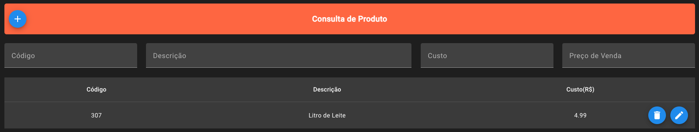
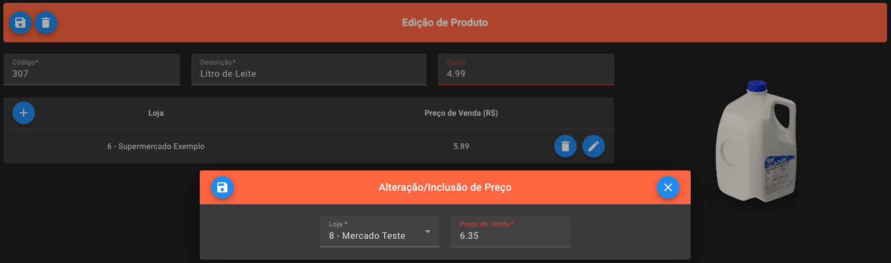

# Product Management System Frontend

Essa aplicação consiste na interface de usuário para exibição das funções construídas no <a href="https://github.com/paulojr-eco/product-management-system-backend" target="_blank"> projeto do backend </a>.

## Tecnologias Utilizadas:

<div>

-  Angular

-  Angular Material

<div>

Com base nessas ferramentas foi possível construir estruturas tabulares que continham as devidas informações sobre os produtos gerenciados, bem como possibilitam que o usuário realize ações de criação, edição e exclusão de elementos:

<div align="center">

  Página de Exibição de Produtos:

  


  Página de Edição de Produto:

  
</div>

## Como executar o projeto:
```bash
# Clonar o repositório
git clone https://github.com/paulojr-eco/product-management-system-frontend.git

# Acessar o diretório
cd product-management-system-fronted

# Instalar as dependências
npm install

#Executar a aplicação
ng serve
```