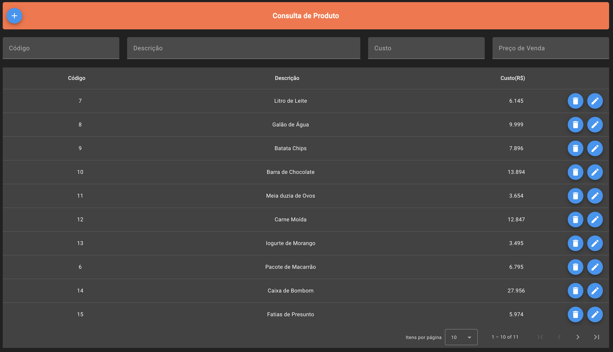
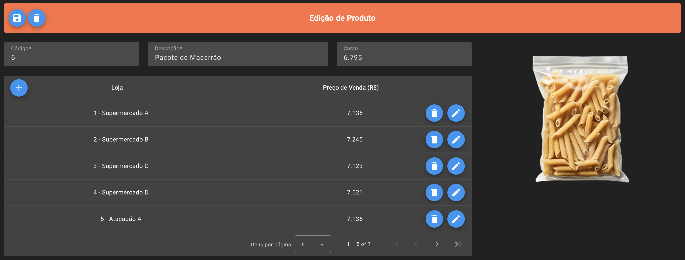

# Product Management System Frontend

<div align="center">
  
</div>

<p align="center">
  <a href="#keyboard-tecnologias">Tecnologias</a>&nbsp;&nbsp;|&nbsp;&nbsp;
  <a href="#computer-executando-a-aplicação">Executando a aplicação</a>&nbsp;&nbsp;|&nbsp;&nbsp;
  <a href="#test_tube-executando-os-testes">Executando os testes</a>
</p>

Essa aplicação consiste na interface de usuário para exibição das funções construídas no <a href="https://github.com/paulojr-eco/product-management-system-backend" target="_blank"> projeto do backend </a>.

# :keyboard: Tecnologias

<div>

-  Angular

-  Angular Material

<div>


Com base nessas ferramentas foi possível construir estruturas tabulares que continham as devidas informações sobre os produtos gerenciados, bem como possibilitam que o usuário realize ações de criação, edição e exclusão de elementos:

<div align="center">

  Página de Exibição de Produtos:

  


  Página de Edição de Produto:

  
</div>

# :computer: Executando a aplicação
Primeiro é preciso ter o Angular CLI instalado em sua máquina, bem como o node e npm. Após isso, certifique-se de o backend está rodando e siga os passos:

```bash
# Clonar o repositório
git clone https://github.com/paulojr-eco/product-management-system-frontend.git

# Acessar o diretório
cd product-management-system-fronted

# Instalar as dependências
npm install

#Executar a aplicação
ng serve
```

# :test_tube: Executando os testes
Os testes foram confeccionados sobre o service de `products`, o qual engloba grande parte da comunicação com o backend. Para executá-los em sua aplicação local, rode o comando no terminal:
```bash
#Executar os testes
ng test
```